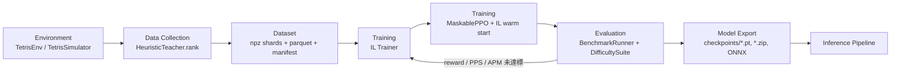
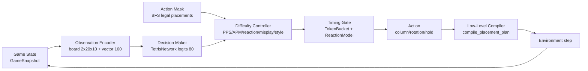
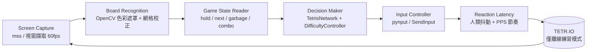

# 1. 系統架構設計

系統分成四層：**規則層（envs/engine）**、**環境層（envs/gym）**、**學習層（policies / trainers / agents / controllers）**、**整合層（integrations）**。
分層原則是「內層不知道外層」：規則層不 import gymnasium，環境層不 import torch。

## 1.1 Training Pipeline

節點職責：

| 節點 | 實作 | 說明 |
|---|---|---|
| Environment | `envs/gym/tetris_env.py` | Gymnasium 介面，提供 Dict observation 與 80 維離散動作 |
| Data Collection | `agents/heuristic_agent.py` | 教師以特徵加權 + 可調深度搜尋選出最佳落點 |
| Dataset | `datasets/*` | 樣本含 board/vector/mask/action/top-k，附 manifest 與設定雜湊 |
| Training (IL) | `trainers/il_trainer.py` | masked cross-entropy + top-k soft targets + early stopping |
| Training (PPO) | `trainers/ppo_trainer.py` | SB3 + `sb3-contrib` MaskablePPO，可載入 IL 權重 |
| Evaluation | `evaluators/*` | 對局指標、難度保真度、JSON/Markdown 報告 |
| Model Export | `scripts/export_onnx.py` | ONNX 供 C++ / 推論伺服器使用 |

## 1.2 Inference Pipeline

推論時三個關鍵決策點：

1. **Decision Maker**：模型輸出 80 維 logits，先套 action mask 再取樣或 argmax。
2. **Difficulty Controller**：依等級決定排名重排（T-Spin / PC / Combo / 攻擊偏好）、失誤機率與出手延遲。
3. **Timing Gate**：TokenBucket 保證 PPS 上限，ReactionModel 加上人類反應與思考抖動。

## 1.3 TETR.IO Integration Pipeline（Phase 6，設計完成、實作未做）

> ⚠️ TETR.IO 服務條款禁止在**線上多人對戰**使用自動化程式。本專案的接入目標僅限離線練習模式
> （40L / Blitz），多人對戰不實作。

介面契約定義在 `integrations/base.py`（`ScreenCapture`、`BoardRecognizer`、`GameStateReader`、`InputController`），
MVP 只提供 `integrations/mock.py` 的離線假實作與 `integrations/tetrio/stub.py` 的明確 TODO。

## 1.4 資料流與時間模型

* **環境時間**：`TetrisEnv.set_piece_time(dt)` 決定每顆方塊消耗的模擬秒數，預設 0.5 秒（2 PPS）。
* **控制器時間**：`DifficultyController` 使用可注入的 `Clock`（正式用 `SystemClock`、測試用 `FakeClock`），
  回傳 `Decision.delay_s`；評估流程把 `clock.advance(delay)` 與 `env.set_piece_time(delay)` 綁在一起，
  因此「PPS 保真度」是可量測的。
* **垃圾行時間**：環境以 `AttackPacer` 依 `opponent_apm × dt` 注入對手攻擊，支援 versus 模式訓練。

## 1.5 為什麼這樣切

| 決策 | 理由 |
|---|---|
| 規則層獨立於 Gymnasium | 資料產生、評估、未來的 TETR.IO 接入都能重用同一份規則 |
| 高階動作為主線 | 可解釋、可用啟發式當教師、可精確模擬 PPS/APM |
| 保留低階執行器 | 未來接 TETR.IO 時把高階落點編譯成按鍵序列（`envs/gym/low_level.py`） |
| DifficultyController 與模型解耦 | 同一個模型可模擬七種等級，不需要訓練七個模型 |
