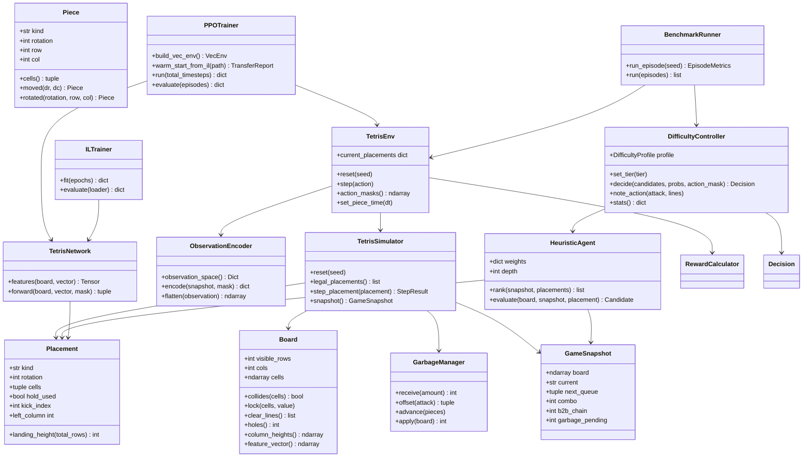
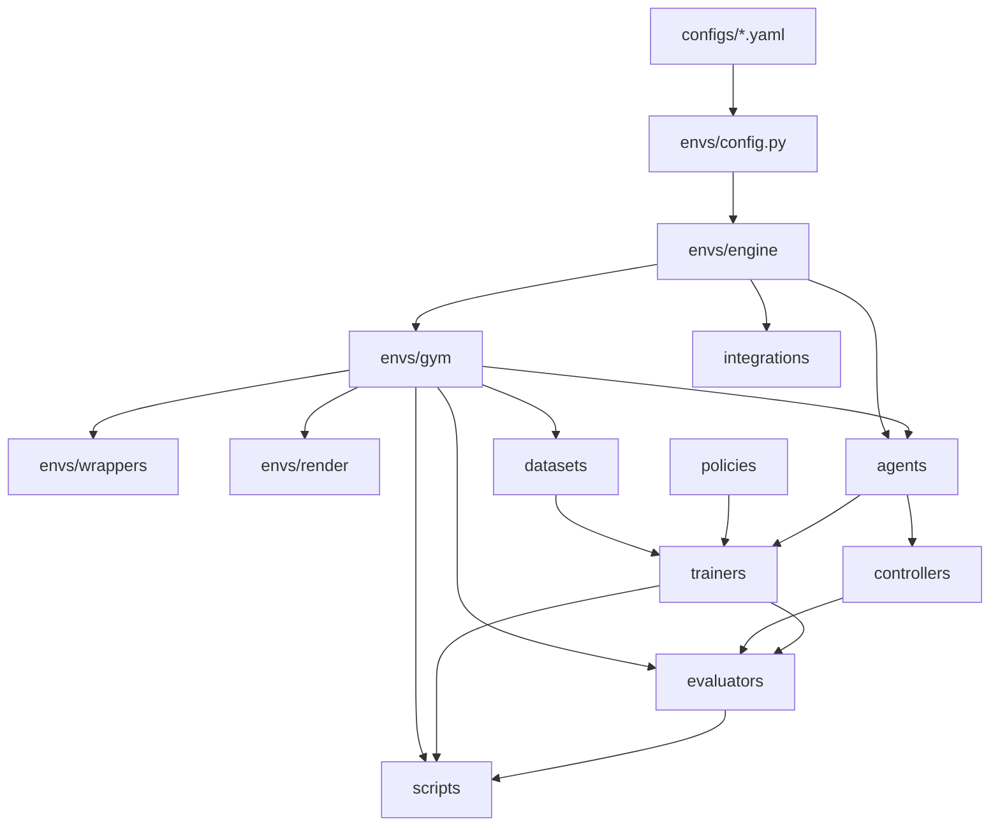
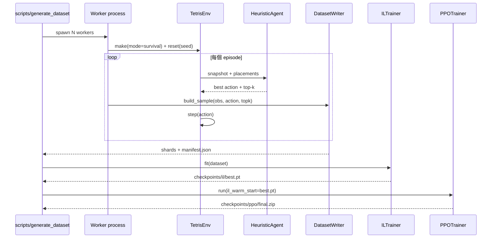
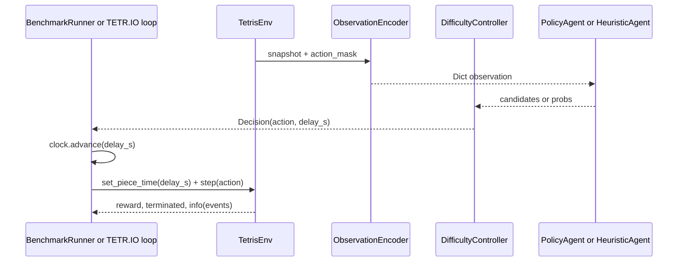

# 11. 生產級程式設計

## 11.1 類別圖

## 11.2 模組依賴圖

**依賴方向單向**：`engine → gym → agents / controllers → trainers / evaluators → scripts`。
反向依賴一律禁止，這讓規則層可獨立測試，也讓 Phase 6 只需實作 `integrations/base.py` 的介面。

## 11.3 公開 API 設計

| 層 | API | 簽章 | 說明 |
|---|---|---|---|
| 環境 | 建立 | `envs.make_env(env_id, **kwargs)` | 已註冊的 Gymnasium 環境 |
| 環境 | 觀測 | `TetrisEnv.reset/step` | 標準 5-tuple，`info` 含 placements / snapshot / events |
| 環境 | 遮罩 | `TetrisEnv.action_masks() -> np.ndarray[bool]` | 供 MaskablePPO 使用 |
| 環境 | 節奏 | `TetrisEnv.set_piece_time(dt)` | 模擬目標 PPS |
| 引擎 | 落點 | `TetrisSimulator.legal_placements()` | 含 hold 變體 |
| 引擎 | 落子 | `TetrisSimulator.step_placement(p, time_cost=None)` | 產生 `StepEvents` |
| Agent | 決策 | `Agent.act(observation, info) -> int` | 所有 agent 共用 |
| 教師 | 排序 | `HeuristicAgent.rank(snapshot, placements, depth=None)` | 供 controller 重排 |
| 控制 | 決策 | `DifficultyController.decide(candidates, probs=None, action_mask=None)` | 回傳含延遲的 `Decision` |
| 控制 | 等級 | `set_tier("Godlike")` / `with_profile(target_apm=45)` | 執行期調整 |
| 資料 | 產生 | `scripts.generate_dataset.generate(out=..., episodes=..., workers=...)` | 平行產生 |
| 訓練 | IL | `ILTrainer(config).fit(epochs=...)` | 回傳 best_top1 等指標 |
| 訓練 | PPO | `PPOTrainer(config).run(total_timesteps=..., resume_from=...)` | 支援 resume 與 IL 熱啟動 |
| 評估 | 基準 | `BenchmarkRunner(env_factory, agent, controller=...).run(episodes)` | 回傳 `EpisodeMetrics` |
| 評估 | 難度 | `run_difficulty_suite(env_factory)` | 七級保真度報表 |

## 11.4 訓練流程圖

## 11.5 推論流程圖

## 11.6 SOLID 對應

| 原則 | 落實方式 |
|---|---|
| S 單一職責 | 規則 / 環境 / 決策 / 控制 / 訓練 / 評估各自獨立套件；`TetrisSimulator` 不管時間，時間交給 controller |
| O 開放封閉 | 新增難度只要加 YAML；新增網路只要在 `BOARD_ENCODERS` 註冊；新增模式只要加 `ENV_IDS` |
| L 里氏替換 | 所有 agent 符合 `Agent` Protocol，`RandomAgent` 與 `PolicyAgent` 可互換 |
| I 介面隔離 | `integrations/base.py` 用四個小型 Protocol，而非巨型遊戲介面 |
| D 依賴反轉 | engine 不知道 gym，gym 不知道 torch；`DifficultyController` 依賴「候選分數」介面而非具體模型 |

## 11.7 可測試性

| 測試檔 | 覆蓋範圍 |
|---|---|
| `test_engine_*.py` | 棋盤、旋轉與 kick、攻擊表、模擬器事件、垃圾行 |
| `test_env_api.py` / `test_env_mask.py` | Gymnasium 契約、mask 正確性、可重現性 |
| `test_obs_encoder.py` / `test_reward.py` | 觀測契約、reward 分量 |
| `test_difficulty.py` | PPS 保真度（±5%）、反應時間、失誤分佈、風格重排 |
| `test_heuristic_agent.py` | 40L 完成、排序、搜尋深度 |
| `test_dataset_io.py` | npz / parquet 往返、manifest |
| `test_evaluators.py` | 指標彙總、報告輸出 |
| `test_integrations_stub.py` | Protocol 結構、mock 行為、stub 明確失敗 |
| `test_smoke.py` | 資料集 → IL → PPO 的端到端可訓練性 |

執行：`python -m pytest tests -q`（實測 100 項通過）。
